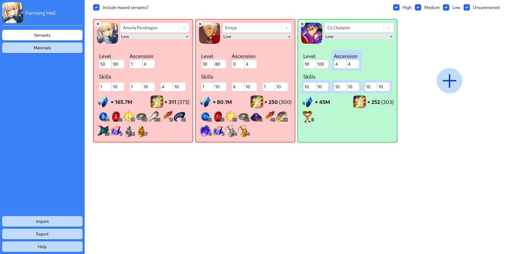

# [Farming Hell: Another Fate/Grand Order Servant Planner][farming-hell]

## Features
 - Add servants to your Chaldea and set their current and target level/skills. Displays each servants' QP, exp and item
   requirements.
 - [Resource usage breakdown](doc/materials.png) shows all materials needed. It also shows [which servants need this
   material](doc/materials-servants.png) as well as [upcoming events you can obtain the item](doc/materials-events.png)
   and the [best farming locations](doc/materials-farming.png).
 - Helpful tooltips provide [details about the current skill](doc/skill-details.png).
 - All data is sourced from the excellent [Atlas Academy][atlas]'s data dumps, so should be pretty accurate and
   up-to-date.

## Non-features and disclaimers
Farming Hell is very much a hobby project written for my own use. As a result, it's probably a little buggy in places
and definitely not as perfect as I'd like.

If you do find any problems, please do let me know on the issue tracker, but here's a couple major known problems and/or
missing features:

 - All servants are stored in your local browser's storage. This means  you can't access servants across multiple
   computers, and wiping your browser data will delete your servants! We do provide the option to Export/Import your
   data, which means you can easily back it up and transfer it, but obviously not ideal!

 - Farming Hell _can_ cope with putting in your entire Chaldea, but does get a little slow. I have ~120 servants, and it
   takes a couple of seconds to load and switch views.

 - QP calculations don't take into account the cost of levelling the servant, only grailing/ascending/upgrading skills.
   I couldn't find the calculations for this anywhere 😬.

## Contributing
I'm not really expecting anyone to contribute to this, but if you do want to, it's always appreciated! Farming Hell is a
pretty standard node project (TypeScript, React, Rollup), so should be _fairly_ understandable to anyone used to JS dev.

 - Clone the repo and open it: `git clone https://github.com/SquidDev/farming-hell && cd farming-hell`.
 - Download dependencies: `npm ci`.
 - Fetch all servant data and run rollup: `npm run build`. You can also use `npm run watch` to rebuild on changes.
 - Launch a web server: `npm run serve`.
 - You can now make your changes. Run `npm run test && npm run lint` to check eslint is happy with your code.

[farming-hell]: https://fgo.squiddev.cc/ "Farming Hell - Fate/Grand Order Servant Planner"
[atlas]: https://atlasacademy.io/ "Atlas Academy"
